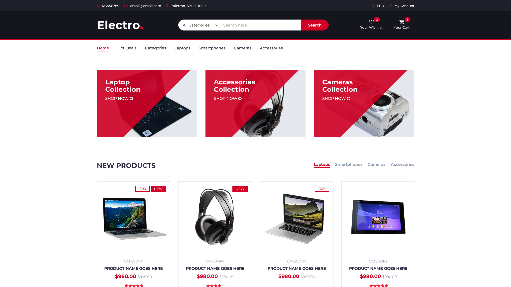

# AWS E-commerce Workshop

⚠️  **DISCLAIMER: Only for development & testing purposes!**

This workshop was created to learn how to get started with infrastructures on AWS.
Thus, it should only be executed in a sandbox/demo AWS environment.

The "AWS E-commerce Workshop" is a lab focused on building a scalable cloud infrastructure for an e-commerce application using AWS.
The primary objective is to learn how to create and manage key components such as a Virtual Private Cloud (VPC), Subnets, Internet Gateways (IGW),
EC2 instances, Security Groups, etc.

This project allows participants to gain essential skills for designing secure, efficient, and optimized cloud architectures for web applications,
providing a solid foundation for implementing real-world e-commerce solutions.

## CloudFormation
### Overview
The [CloudFormation stack](ecommerce.yaml) automates the process of infrastructure deployment.

Here's a basic view:

- VPC
  - Internet Gateway (IGW) + VPCGatewayAttachment
  - Subnet: Public Subnet
  - Routing Table: Public Routing Table
    - Routes:
      - `0.0.0.0/0  IGW`

- EC2
  - Security Group: WebSecurityGroup
    - Rules:
      - Protocol: `tcp`  FromPort: `80`  ToPort: `80`  Source: `0.0.0.0/0`
      - Protocol: `tcp`  FromPort: `22`  ToPort: `22`  Source: `0.0.0.0/0`
  - Instances:
    - Web Server

### Parameters
The following parameters can be configured when creating the stack:
- EcommerceAZ: Public subnet region (Default: `eu-central-1a`)
- EcommerceVPCCIDR: IP range to allocate for the Ecommerce VPC (Default: `10.0.0.0/22`)
- PublicSubnetCIDR: IP range to allocate for the public subnet (Default: `10.0.0.0/24`)
- AmazonLinuxAMIID: AMI to use for the EC2 instance (Default: Amazon Linux 2023 x86_64)
- EC2InstanceType: EC2 instance type (Default: `t2.micro`)
- KeyPairName: Keypair used to connect to the EC2 instance (Default: `ecommerce-key`)

### Deploying the stack
Deploying the CloudFormation stack is real easy.

First, create an **EC2 keypair**, otherwise you won't be able to create the stack:
1. AWS Management Console -> EC2
2. Networks & Security -> Key pairs
3. Create a new keypair named `ecommerce-key`

The name can be modified to your liking, just don't forget to update `KeyPairName` when creating the stack.

You can now deploy the CloudFormation stack:
1. AWS Management Console -> CloudFormation
2. Create stack -> With new resources (standard)
3. Choose an existing template; Upload a template file (upload [ecommerce.yaml](ecommerce.yaml)); Click "Next"
4. Stack name: `Ecommerce-Workshop`
5. Parameters: modify to your liking; Click "Next"
6. In the next two pages, review the changes, and confirm the stack creation.

NOTE: modify `EcommerceAZ` if the region where you're deploying the stack from isn't `eu-central-1` (Europe/Frankfurt)

That's it! The stack should now be successfully deployed.

In the **Outputs** section of the newly created CloudFormation stack, you should see two key-value pairs:
- `EcommercePublicSubnetAZ`: which AZ was used for the public subnet
- `EcommerceEC2PublicIP`: the EC2 instance's public IPv4 address

You can connect via HTTP to the EC2 instance, and you should see the demo website.

